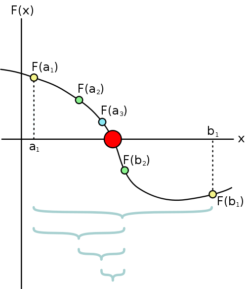

# RootFindingMathMethods in C++ 

Welcome to the RootFindingMathMethods repository! This repo provides an in-depth exploration of the Bisection Method and other  powerful numerical techniques designed to find roots of transcendental equations. Root finding is a fundamental problem in mathematics and engineering, with applications spanning various fields.

## Introduction

Finding the roots of transcendental equations is a critical challenge in scientific and engineering domains. The RootFindingMathMethods ( C++ ) focuses on presenting a detailed analysis of the Bisection Method, equipping researchers, engineers, and enthusiasts to tackle root finding with confidence and efficiency. 

## Bisection Method

The Bisection Method is a simple and robust numerical technique used to find approximate solutions for a single real root of a continuous function. It's often employed when other root-finding methods may not be suitable, especially for functions that do not have easily calculable derivatives or are not well-behaved.

Here's how the Bisection Method works:

Initial Interval: Start with an interval [a, b] such that the function changes sign at the endpoints (f(a) * f(b) < 0), indicating a root exists within this interval.

Midpoint: Calculate the midpoint of the interval: c = (a + b) / 2.

Evaluate and Compare: Calculate the function value at the midpoint, f(c).

If f(c) is close enough to zero (within a desired tolerance), then c is an approximation of the root, and the method terminates.
If f(c) has the same sign as f(a), the root lies in the right subinterval [c, b]. Update the interval to [c, b] and go to step 2.
If f(c) has the same sign as f(b), the root lies in the left subinterval [a, c]. Update the interval to [a, c] and go to step 2.
Iteration: Repeat steps 2 and 3 until the interval becomes sufficiently small or until the desired level of precision is achieved.

The Bisection Method has some advantages:

Guaranteed Convergence: The method always converges to a root as long as the initial interval contains a root and the function is continuous.
Simplicity: It's easy to implement and does not require knowledge of the derivative of the function.
Robustness: It works for a wide range of functions, even those that may be discontinuous or difficult to analyse.
However, it can be slower to converge compared to more advanced methods like Newton-Raphson or secant methods, especially for functions with steep slopes or complex behaviour.

## (Other Methods Coming Soon)

Stay tuned for updates as we expand the root-finding math methods to include more advanced and diverse root-finding methods. We are committed to providing you with a comprehensive set of tools to address a variety of root-finding challenges.

## Contributing

We invite contributions to enhance the root-finding math methods. If you have ideas for improvements, bug fixes, or new root-finding methods, please don't hesitate to open an issue or submit a pull request. Adherence to the code of conduct and guidelines provided in the repository is appreciated.

We trust that root-finding math methods will prove invaluable in your mathematical and engineering pursuits. Empower yourself with the Bisection Method and other upcoming techniques to solve intricate transcendental equations. Happy root hunting!
